# Political Contributions in Arizona 
Dimitri Theoharatos  

Political Contributions in Arizona 
========================================================

As an avid follower of politics and lifelong resident of Arizona, I decided to explore the political contributions made by Arizonans in the 2016 presidential election cycle. 


    


*The following dataset contains information about Arizona voters and the presidential candidate they donated to.  The information contains instances from both the general and primary elections as well as additional information about the contributor such as the amount they provided, their city, zip code, occupation, and employer.  In addition, a subset of data was extrapolated to explore as  certain information is redundant or not relevant to the analysis.*

# Univariate Plots Section

Running a quick summary on the data, it is clear that the top contenders for the presidency also happened to be the candidates with the largest number of contributions.  This does not much prove much yet, considering the Arizona primary occurs later in the election season and thus several of the contenders had already dropped out or stood very little chance to win.  


```
##                       cand_nm                 contbr_nm     
##  Clinton, Hillary Rodham  :58007   SAYLER, BECKY   :   256  
##  Sanders, Bernard         :40964   PICKETT, SUZETTE:   210  
##  Trump, Donald J.         :22004   PICKARD, LISA   :   193  
##  Cruz, Rafael Edward 'Ted':12859   LOPEZ, ROBERT   :   164  
##  Carson, Benjamin S.      : 7415   THOMPSON, DAVID :   161  
##  Rubio, Marco             : 2906   CASTRO, ANNA    :   151  
##  (Other)                  : 3548   (Other)         :146568  
##      contbr_city                contbr_occupation contb_receipt_amt 
##  TUCSON    :27924   RETIRED              :45234   Min.   :-5400.00  
##  PHOENIX   :25750   NOT EMPLOYED         :16097   1st Qu.:   15.00  
##  SCOTTSDALE:14055   INFORMATION REQUESTED: 5322   Median :   27.00  
##  MESA      : 7865   ATTORNEY             : 2258   Mean   :   85.98  
##  TEMPE     : 5341   PHYSICIAN            : 2212   3rd Qu.:   75.00  
##  CHANDLER  : 5330   (Other)              :76559   Max.   :10800.00  
##  (Other)   :61438   NA's                 :   21                     
##  election_tp    contb_receipt_dt 
##       :  402   12-Jul-16:  1895  
##  G2016:48509   11-Jul-16:  1458  
##  O2016:   29   29-Feb-16:  1348  
##  P2016:98762   31-Mar-16:  1231  
##  P2020:    1   30-Apr-16:  1113  
##                19-Jul-16:  1070  
##                (Other)  :139588
```


Based on the summary, it looks like there are a couple of issues in the data that we can clean immediately.  Interestingly, the original "contb_receipt_amt" has negative values, which was fixed by simplying setting its value to the absolute value of the original value assuming the negative sign was a typo.  Furthermore, some of the election types specified are neither for the general nor the primary 2016 election cycle, so I removed these entries as well. 


Let's investigate the amount of each contribution further.  

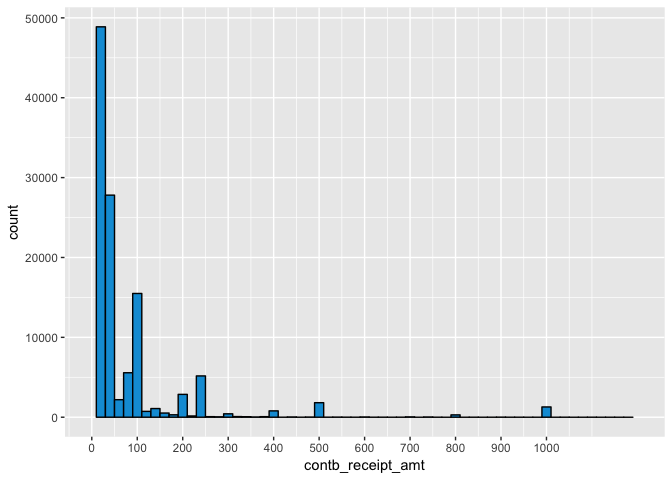<!-- -->


An overwhelming majority of the contributions were less than $100 in value.  There are also minor spikes at values divisible by 100 (i.e. 400, 500, 1000).

To better illustrate the contribution amount, a larger binwidth can be utilized to effectively show that nearly the entire histogram is within the bin encompassing amounts of 0-100$. 

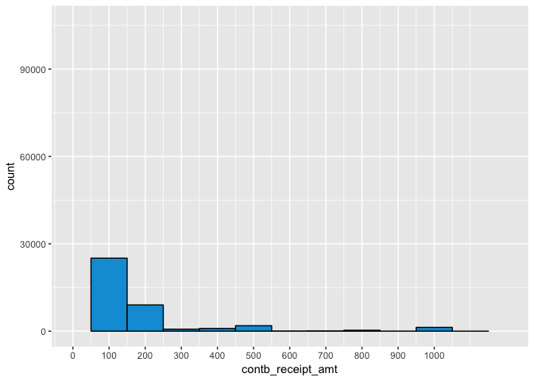<!-- -->

For a more aesthetic approach, the heavy right skew can be nullified by scaling the x-axis implementing a log scale. This is performed below. 

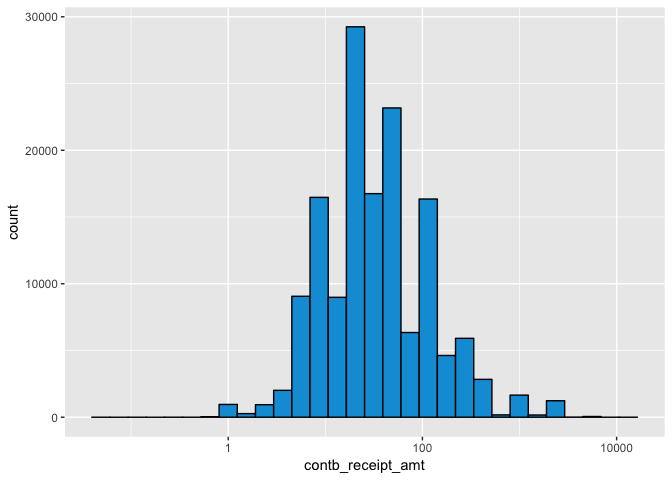<!-- -->

Scaling the x-axis using a log10 transformation more clearly illustrates the vast concentration of contribution amounts occurring in the regions from ten to a hundred dollars. Now, let's investigate the type of election by comparing the total number of contributions provided to the general election compared to the primary election. 

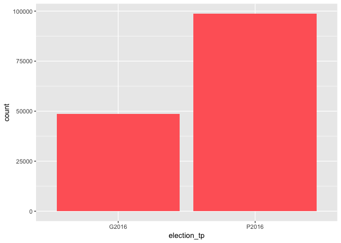<!-- -->

It looks like there are nearly double the contributions for the primary elections versus the general election, likely because of the amount of contributions Bernie Sanders received in the primary (he had over 40,000 contributions as shown in the summary earlier). 

Since so many candidates are included within the dataset, it would be useful to explore a subset of the data that only includes the viable contenders.  Once again, this is useful because Arizona has a relatively late primary season, making the bottom contenders much less likely to receive any financial support this late in the race.  


```
##                 Bush, Jeb       Carson, Benjamin S. 
##                       360                      7401 
##  Christie, Christopher J.   Clinton, Hillary Rodham 
##                        57                     58007 
## Cruz, Rafael Edward 'Ted'            Fiorina, Carly 
##                     12849                       808 
##      Gilmore, James S III        Graham, Lindsey O. 
##                         1                        10 
##            Huckabee, Mike             Jindal, Bobby 
##                       105                        10 
##             Johnson, Gary           Kasich, John R. 
##                       346                       333 
##          Lessig, Lawrence            McMullin, Evan 
##                         4                        34 
##   O'Malley, Martin Joseph                Paul, Rand 
##                        43                      1009 
##    Perry, James R. (Rick)              Rubio, Marco 
##                         2                      2906 
##          Sanders, Bernard      Santorum, Richard J. 
##                     40964                        20 
##               Stein, Jill          Trump, Donald J. 
##                       175                     21698 
##             Walker, Scott     Webb, James Henry Jr. 
##                       124                         5
```

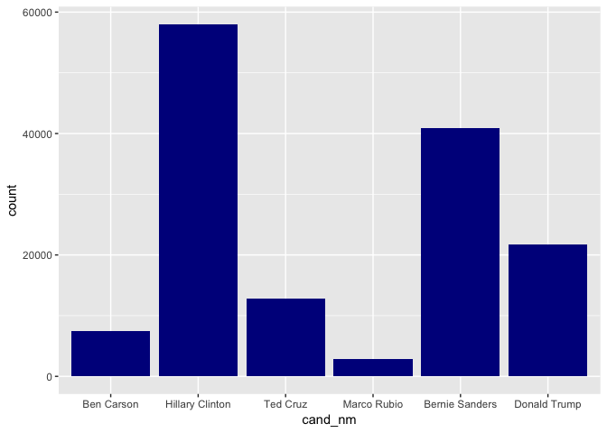<!-- -->

Interestingly, the two Democratic contenders (Hillary Clinton and Bernie Sanders) both have signficantly more contributions than their Republican counterparts even though Arizona is a traditionally conservative state.  

This marked difference between the total amount of contributions for each party piqued my interest, so I decided to get a clearer picture by creating a party variable to add to the dataset. 

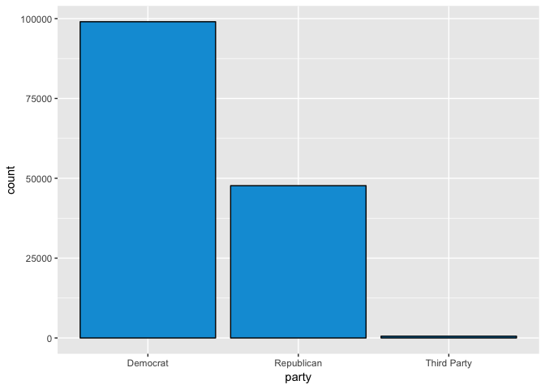<!-- -->

In total, the number of contributions to Democratic candidates essentially doubles that of their Republican counter parts with 3rd party candidates lagging far behind. Note, this is just the total number of contributions, not taking into account the actual contribution amounts.  This will be further investigated in the bivariate section. 


# Univariate Analysis

The dataset details individual contributions made to politicians by Arizonans in the 2016 election cycle and provides several pieces of information for each of those unique contributions. This information includes the candidate, contribution amount, date of the contribution, type of election (primary or general) as well as the contributor and their corresponding city, zip code, occupation, and company.For univariate analysis, the features of interest to me were the contribution amounts, the candidates and their respective party, and the election type (general vs primary).  The only new variable I created was the candidate's party. 

Alternative modifications I made to the data were to create data frames only for the top candidates since several of the candidates received virtually no contributions and congested the visualizations, and getting rid of some of the features that were either redundant or not highly useful such as id or memo information. One of the more unusual findings was the fact that Democratic candidates received more than twice as many contributions as their Republican counterparts.  This is surprising both because Arizona typically leans heavily red and there were several more Republican candidates in the race.  There were no steps to change the structure of the data for univariate analysis. 

# Bivariate Plots Section

Piggybacking off of the univariate analysis involving the party and total number of contributions, it would be interesting to see the actual monetary amount as a function of party association.  To do this, the average contribution amount can be found grouped by party. 

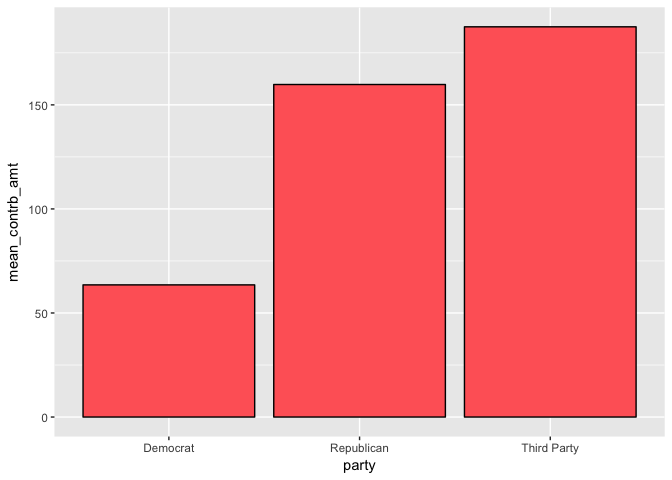<!-- -->

The Republicans have nearly triple the average contribution amount compared to Democrats, with 3rd party candidates faring even higher.  This results in the total contribution amount by the Republicans higher than the Democrats as depicted by the total contributions plot below. 

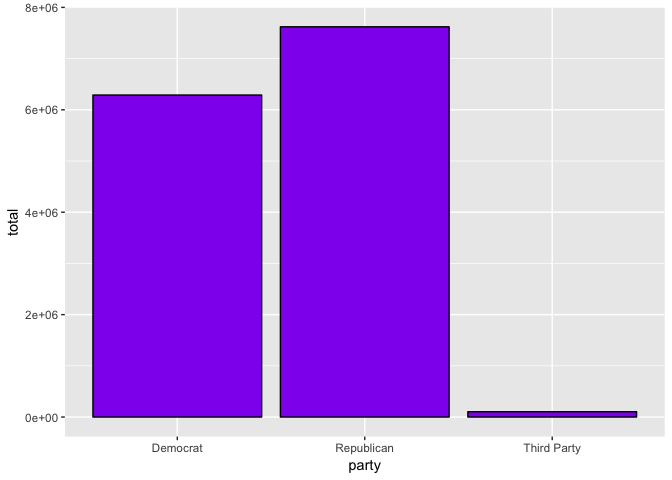<!-- -->

It would be useful to visualize this relationship as a histogram to better understand the distribution of each party's contributors.

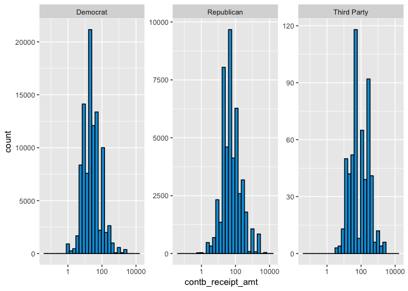<!-- -->

The plot above is difficult to interpret since the y-axis values are on different scales.  This could be solved by condensing all of the plots onto a single diagram replicated below. 

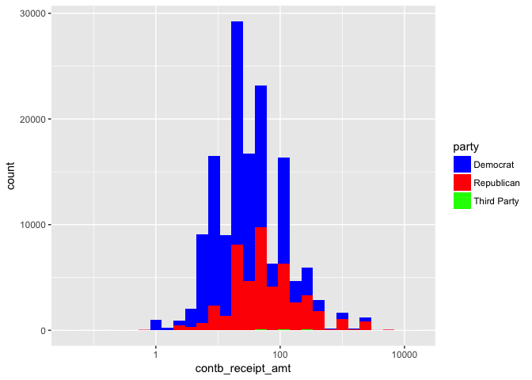<!-- -->

As mentioned before, there are clearly more contributions made by Democrats in total, but the heavy weighting of Republican contributions towards higher amounts gives them an edge in total contributions.  Notice that 3rd party candidates are barely even visible on the graph since they have such few contributions relative to the two major parties. Let's look into the individual candidates now rather than the parties as a whole. 

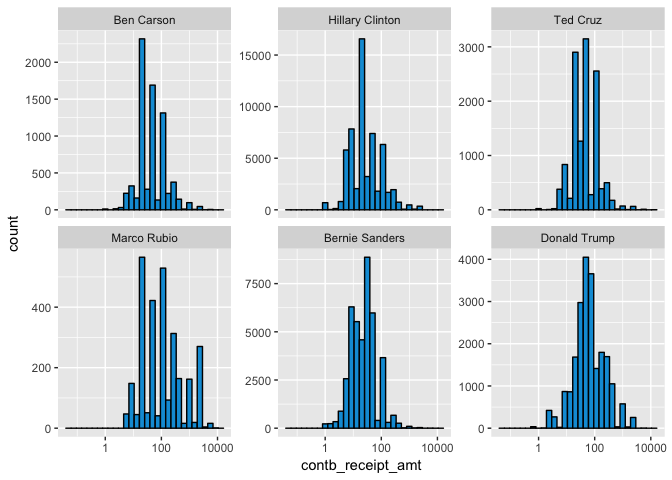<!-- -->

  It appears that Bernie Sanders and Hillary CLinton have slightly lower contribution values compared to the rest of the field and Marco Rubio seems to have had higher contribution amounts on average.  This can be confirmed implementing a boxplot. 

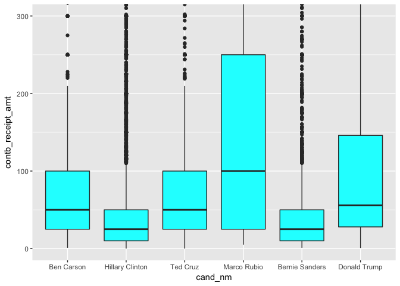<!-- -->

As expected, it looks like the median contribution amount received is lowest for Bernie Sanders with Hillary Clinton being a close second and Marco Rubio being the highest of the top contenders.  

It might be useful to compare the contribution amounts for the election type as well.  This can be done using boxplots shown below. 

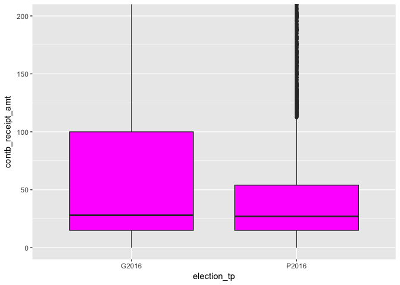<!-- -->

The median values for both the general and primary elections are essentially the same, with the general election having a much higher interquartile range. Since the general is of larger import, it would make intuitive sense for the average contribution to be higher, hinted at by the significant right skewness of the general election's distribution.  This can be confirmed with a bar chart comparing the mean contributions for each election type. 

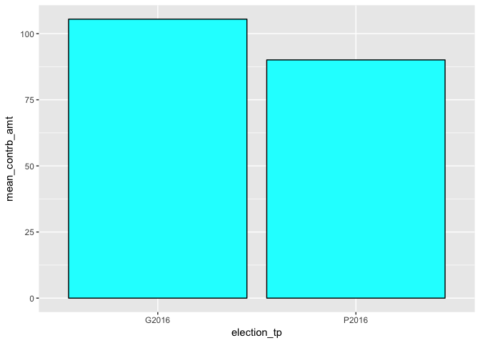<!-- -->

Based on the above analysis, it seems the general election does indeed have a higher average contribution amount (by $15.40 or approximately 17%).  

Most of the analysis so far has revolved around the party of the candidate, the election type, or the candidates themselves.  Let's change directions a bit and look into the information of the contributors instead. 


```
##            TUCSON           PHOENIX        SCOTTSDALE              MESA 
##             27877             25712             13988              7829 
##             TEMPE          CHANDLER          GLENDALE           GILBERT 
##              5339              5319              3600              3596 
##          PRESCOTT            PEORIA            SEDONA         FLAGSTAFF 
##              3431              2708              2484              2420 
##          SURPRISE          SUN CITY      GREEN VALLEY   PARADISE VALLEY 
##              2293              2256              1970              1614 
##        ORO VALLEY              YUMA          GOODYEAR     SUN CITY WEST 
##              1597              1473              1340              1300 
##           KINGMAN      SIERRA VISTA    FOUNTAIN HILLS        CAVE CREEK 
##              1262              1075              1057              1045 
##  LAKE HAVASU CITY   PRESCOTT VALLEY         SUN LAKES    SAN TAN VALLEY 
##               995               982               972               855 
##       CASA GRANDE           BUCKEYE   APACHE JUNCTION            MARANA 
##               779               750               749               720 
##        COTTONWOOD       GOLD CANYON       QUEEN CREEK            PAYSON 
##               617               609               524               522 
##   LITCHFIELD PARK     BULLHEAD CITY              VAIL            ANTHEM 
##               497               496               494               491 
##          MARICOPA      CHINO VALLEY          CAREFREE            BISBEE 
##               447               425               404               386 
##         SAHUARITA          HEREFORD          AVONDALE             DEWEY 
##               373               363               360               316 
##            LAVEEN          SHOW LOW        WICKENBURG     GOLDEN VALLEY 
##               316               312               310               307 
##             TUBAC           SAFFORD         CORNVILLE         RIO VERDE 
##               269               268               239               237 
##         SNOWFLAKE            ORACLE          BRAMPTON            BENSON 
##               229               215               210               202 
##          COOLIDGE        CAMP VERDE          RIO RICO         PATAGONIA 
##               194               180               179               175 
##           RIMROCK              ELOY     DOLAN SPRINGS         CLARKDALE 
##               171               167               159               145 
##         EL MIRAGE          FLORENCE           WELLTON       FORT MOHAVE 
##               140               140               136               135 
##           DOUGLAS              PAGE           PINETOP           SONOITA 
##               133               124               123               120 
##          TOLLESON BLACK CANYON CITY            JEROME      ARIZONA CITY 
##               119               118               117               114 
##           NOGALES             GLOBE          LAKESIDE           WADDELL 
##               111               110               109               101 
##         OVERGAARD      GRAND CANYON             YOUNG            TAYLOR 
##                96                95                84                81 
##           WILLCOX             PARKS         NEW RIVER          SELIGMAN 
##                81                79                76                76 
##          CONGRESS          WITTMANN            PEARCE      QUEEN VALLEY 
##                73                73                72                72 
##           WINSLOW              PINE            PARKER           (Other) 
##                70                68                66              2964
```

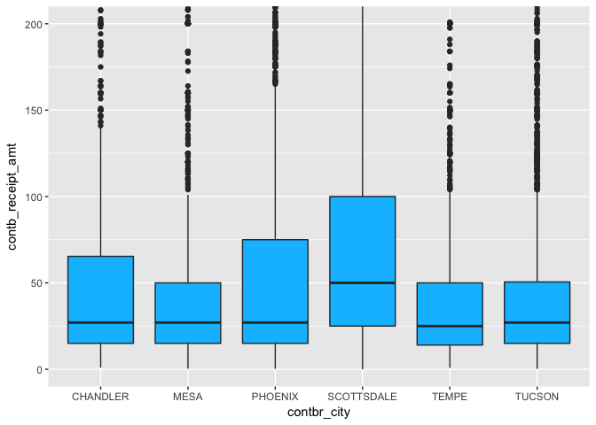<!-- -->


Looking at the cities with at least 5000 individual contributions, it looks like Scottsdale has nearly double the median contribution amount in comparison to other major cities.  Scottsdale also happens to be the wealthiest city in Arizona, so it makes sense individuals are able to donate more to their preferred candidate. It would also be interesting to see the number of contribution for each city separated by party.  This will give a sense of the party makeup for each major city within Arizona.  


```r
ggplot(data = pc_top_6_cities, aes(fill = party,x = contbr_city)) +
        geom_bar(position = "dodge") + scale_fill_manual(values =c('blue' ,'red', 'green'))
```

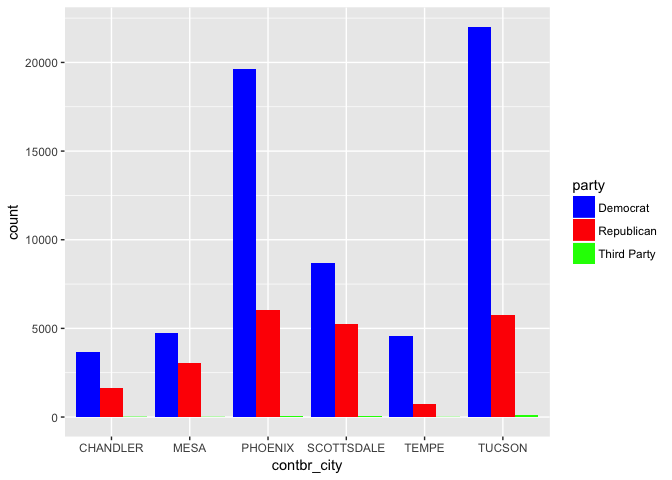<!-- -->
      
Amazingly, it seems that Democrats greatly outnumber Republicans in terms of number of contributions in every major city. Rather than looking at the residence for each contributor, let's look more into their occupations to see if that has any impact on their contribution amount. Since there are so many available occupations, it seemed reasonable to split the occupation status into three general categories: employed, unemployed, and retired.  

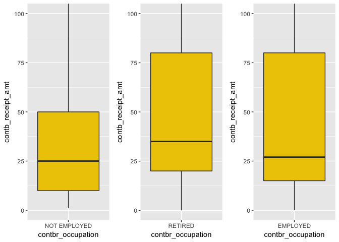<!-- -->

An initial glance at the boxplots for employment status clearly shows a higher median for the retired population, but the difference in median between those unemployed and employed are nearly the same.  It would be useful to look into the mean as well to get a better grasp of the contribution amounts from each of these groups. 


```
## Employed Mean Contribution:  102.0168
```

```
## Unemployed Mean Contribution:  44.85044
```

```
## Retired Mean Contribution:  93.54549
```

# Bivariate Analysis

In this section, I expanded on some of the univariate analysis by calculating significant statistical properties such as the mean of the contribution amount in order to compare among the candidates, parties, occupation status, and contribution city.  Interestingly, the mean contribution amount for third party candidates was significantly higher in comparison to the two major parties.  These contributions still had little impact however considering the two major parties (Republicans and Democrats) had vastly more contributors. In addition, Republicans had a much higher average contribution amount than the Democrats, which offset the fact that they were outnumbered in total number of contributors in every single major city.   

I created a new variable based on the occupation status to determine whether or not individuals were retired, employed, or unemployed.  I did this because there were much too many occupations to keep track of and aggregating the data would allow holistic analysis on employment status and its correlation to contribution amounts.  There was a strong positive correlation between employment status and the average contribution amount (as expected).


# Multivariate Plots Section

Building on the grouped box plot in the previous section that illustrated the number of contributions for each city broken up by party, I thought it would be useful to find the total contributed by each city rather than just the number of contributions. 

<!-- -->

Even though the Democrat contributions vastly outpaced those of Republicans, the above plot demonstrates that the total amount of contribution money tends to favor the Republicans.  This can be visualized and confirmed by visualizing the distributions for each city as well. 

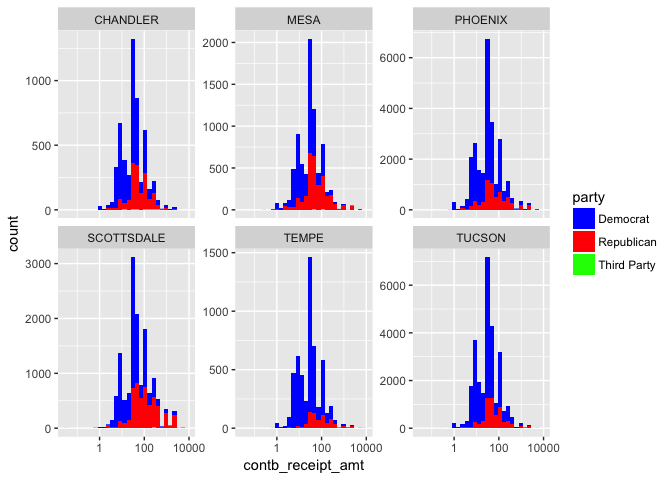<!-- -->

As illustrated above, though the Democrats encompass much more area on the histograms, the left-skewed distribution behavior of the Republican contributions shows why they actually have an advantage when it comes to the total amount in campaign contributions. 

Apart from the distinction between the implied time difference between the primary and general presidential elections, most of the analysis thus far has been static in nature- i.e. with no temporal component.  It would be useful to integrate the previous analysis with a time variable to take into account the dependency of campaign contributions on which phase the election season is in.  This analysis is performed below. 

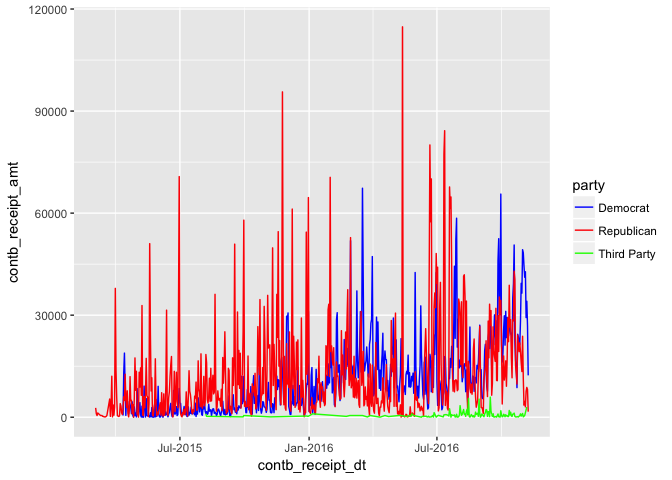<!-- -->

The first investigation into the sum of the campaign contributions is a bit noisy making it difficult to extrapolate much value from it.  Let's investigate the median of the contributions instead. 

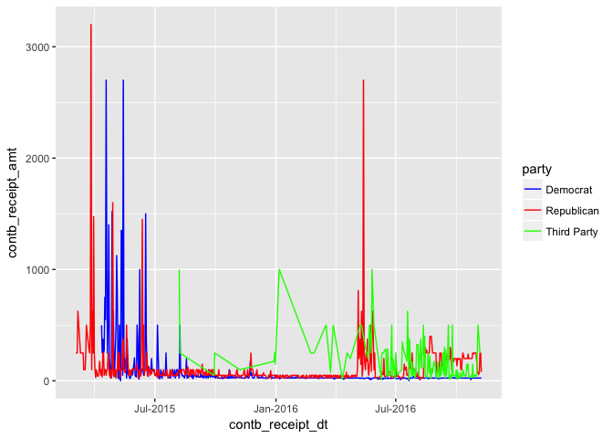<!-- -->

Similarly, breaking up each individual contribution by its median demonstrates highly variable behavior.  It is likely that since each day has a limited number of contribution samples, the median of each sample varies greatly.  One way to alleviate this issue is by smoothing out the samples and accepting more bias in the model. 

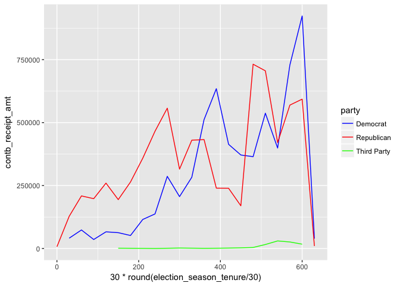<!-- -->

Smoothing the summation of campaign contributions over 30 day increments demonstrates more useful analysis.  There is a clear trend upwards as the elections near closer.  It should be mentioned that the primary election in Arizona is on day 386 in the graph above whereas the general election date is the final data point. Let's do the same analysis using the median. 

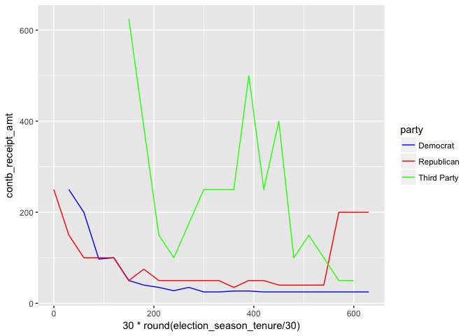<!-- -->

All three parties exhibit similar starting behavior taking the mean over 30 day periods.  Initially, the median is high and then rapidly decreases until a couple months before the primary.  This could potentially stem from the first of the donors being more passionate about their respective candidate. There is still high variance for third party candidates, but this makes sense since they receive signficantly fewer donations in comparison to the two major parties. Lets perform a similar analysis breaking down by the top candidates. 


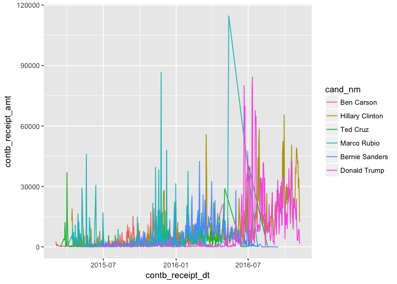<!-- -->

Once again, without smoothing, the plot is a bit too noisy to extrapolate anything useful from it.  Smoothing the function over a thirty day period should reduce this variance. 

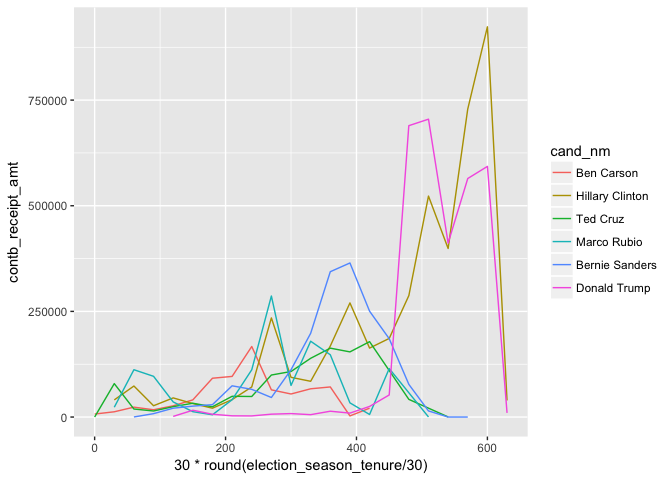<!-- -->

Smoothing over a thirty day period enables much cleaner results.  It is clear who the final two contenders were by their continuous reception of donations (Trump and Clinton).   Furthermore, it demonstrates the rise and fall of each of the top candidates by their spikes in donations and their eventual downfall.  

Working in the temporal domain compelled me to also invesitgate any geographical correlations in the data as well.  

<!-- -->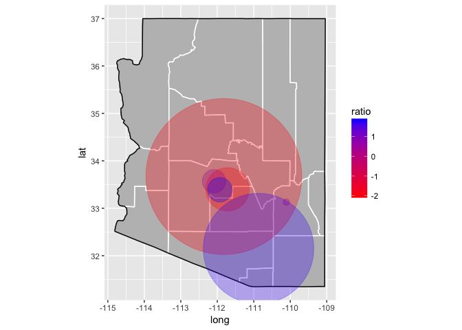<!-- -->

Ultimately, I created a plot where each bubble is proprtional to the total difference in contribution amounts between the two major parties and the color of the bubble is determined by a ratio of the total number of contributors for each party.  It ended up being a bit congested and not exactly what I had intended, but it was a learning exercise nonetheless. 

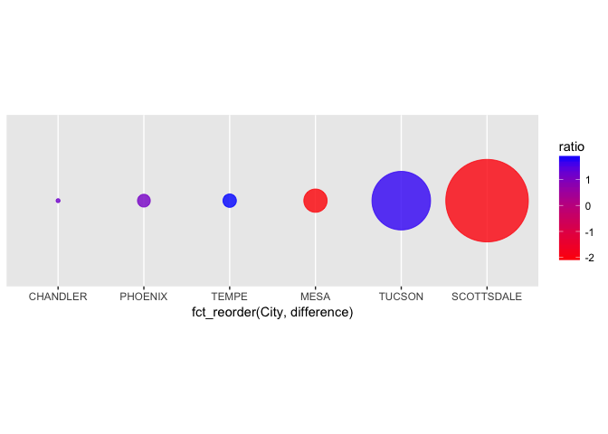<!-- -->

Instead of using the bubbles mapped onto a map of Arizona, I instead plotted them side-by-side so an actual estimate could be made of the relative difference in total contribution amounts by city.  It looks like Tuscon and Scottsdale were the biggest net contributors for the Democrats and Republicans, respectively. 

Finally, since a time variable has been instantiated, scatterplots of each contribution can be performed. 

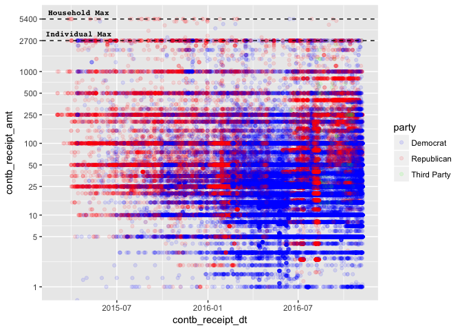<!-- -->


# Multivariate Analysis

The multivariate analysis demonstrated several other relationships among the variables that were not apparent in earlier univariate or bivariate analysis.  First, it is clear that even though Democrats had more contributions, the Republicans offset this with higher contributions leading to higher fundraising for their respective candidates.  Furthermore, by including a time variable, it became clear that contributions increased greatly as the general election approached.  One interesting phenomenon was that Republicans made a much higher number of contributions early on in the election season (2015).  This may derive from the fact that the primary was wide open, with nearly every prominent Republican making a case as to why they should be the party's respective candidate.  On the other hand, most Democrats generally accepted that Hilary Clinton was going to be their torch bearer and there was no need to fundraise so early on in the election season.  


# Final Plots and Summary

After performing univariate, bivariate, and multivariate analysis, I compiled three of the most informative graphics produced and provided further analysis beneath it.  

### Plot One
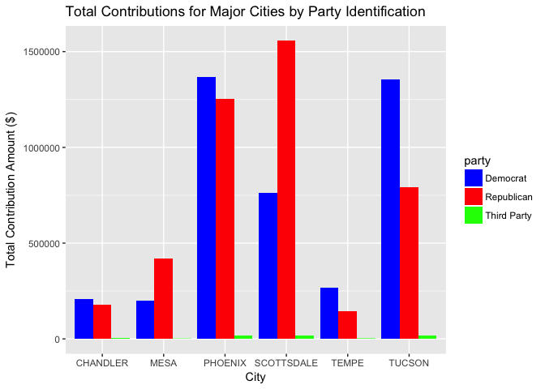<!-- -->

This plot is useful because it neatly illustrates major cities in Arizona and the difference in total contributions among them divided by each party.  In the wealthier, Suburbanite areas (Scottsdale, Mesa), Republicans vastly outspent Democrats.  In the urban and diverse regions (Phoenix, Tempe, Tucson), Democrats were able to rake in more contribution dollars.  The graph also demonstrates the massive disparity in funding between the two major parties and any third party contenders. 

### Plot Two
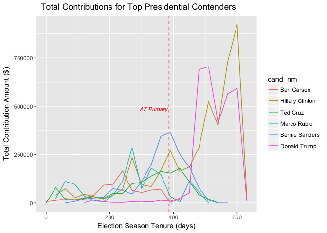<!-- -->


This time series plot of contribution amounts is also packed with information.  It demonstrates the gradual increase and decrease of each candidate, which is closely linked to the rise and fall of each of their respctive election runs.  At one point (~day 400 of the election season), Bernie Sanders was bringing in the most amount of campaign contributions, suggesting that his growing number of supporters believed he had a decent chance of securing the nomination.  Donald Trump's trajectory is also interesting as he received nearly no donations until after the primary election (as he had intended) but still managed to secure the nomination, upending decades of political wisdom that contributions are necessary for victory.  With the addition of the AZ primary vertical line, the plot also demonstrates that once the primary was over, only the top two candidates for each party remained as viable options for campaign contributors as their values skyrocketed.  

### Plot Three

```r
# message = FALSE, warning = FALSE, Plot_Three}

ggplot(pc_by_date, aes(x=contb_receipt_dt, y=contb_receipt_amt)) + 
      geom_jitter(aes(color = party),alpha = 0.1) + 
      scale_color_manual(values = c("blue", "red", "green"))  + 
      geom_hline(aes(yintercept=5400), linetype = 'dashed', color = 'black') +
      geom_text(data=data.frame(x=as.Date("2016-08-15"),y=5400), aes(x, y), 
          label="Household Max", vjust=-1, size = 3, 
          fontface = 'italic', color = 'black', family= 'Courier') +
      geom_hline(aes(yintercept=2700), linetype = 'dashed') + 
      geom_text(data=data.frame(x=as.Date("2016-08-15"),y=2700), aes(x, y), 
          label="Individual Max", vjust=-1, size = 3, 
          fontface = 'italic', family = 'Courier') + 
      scale_y_log10(breaks = c(1,5,10,25,50,100,250,500,1000,2700,5400), 
                    limits = c(1,5500)) + 
      scale_x_date(date_breaks = "4 months") + 
      labs(x = "Date of Campaign Contribution", 
           y = "Campaign Contribution Amount ($)",
           title = "Individual Contributions over Time by Party Identification")
```

```
## Warning: Transformation introduced infinite values in continuous y-axis
```

```
## Warning: Removed 527 rows containing missing values (geom_point).
```

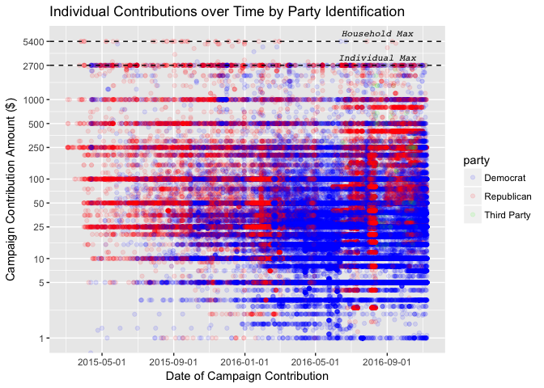<!-- -->


This final plot generates several interesting tidbits of information.  First, it is clear that there are certain contribution amounts that are donated more often than others such as the maximum contribution amounts allowed in an election (2700 and 5400 for an individiual and couple) as well as other nice, round numbers (50,100,1000,2000).  Furthermore, it looks like Republicans were initially outspending Democrats early on in the election season but Democrats began to outpace the Republicans starting in 2016.  This may derive from the fact that there were so many viable Republican contenders early on in the election cycle whereas the Democrats only really had two (or even one some would argue).  Also, the plot becomes denser as the gneneral election nears, meaning several more contributions are being made. Lastly, once again this plot further deepens the notion that Democrats contributed more but made smaller contributions to their respective candidates and that Third Party contributions are virtually nonexistent in comparison to the two major parties.   

# Reflection
Analyzing the Arizona contributions made to the 2016 presidential election was both challenging and intriguing.  Utilizing the ggplot functionality was initially a difficult task, but eventually proved itself to be a vastly powerful too for data visualizations. It was also difficult to conceptualize best ways to visualize the individual data points since there were nearly 150,000 contributions made.  To resolve this, I typically lessened the data set size by focusing on top cities and candidates.  

Understanding what to analyze went relatively well.  With a basic understanding of election politics and the nature of political parties, I was able to quickly decide on the best features to investigate to visualize their impact.  Furthermore, as an Arizona resident, I understand the general make up of each city based on geography and diversity in each city, so I could couple this advantage with my poltical knowledge to improve my investigative abilities.  

I was shocked by the number of Democratic contributors in the election.  Arizona leans heavily conservative and it seems counterintuitive that a state with a Republican legislature, Governorship, and both U.S. Senators would have strong a strong contributing base for the Democrats.  This may hint at the changing demographics of the state.  That would be a useful exercise for future iterations of this project- incorporating data on diversity and changing demographics to understand its impact on campaign contributions.  In addition, it would also be useful to examine more of the data that did not go to a top presidential contender or did not originate from a major city.  This would lead to a wider understanding of the nature of Arizona and their campaign contributions.  
