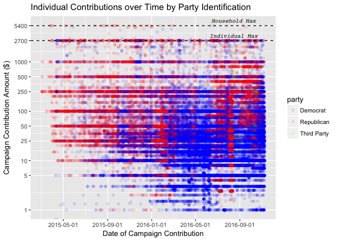

# Exploratory Data Analysis of AZ Political Contributions in the 2016 Presidential Election

This project investigates contributions made from Arizonans to the 2016 presidential contenders.  The exploration is implemented using R in an RStudio programming environment.  The R Markdown notebook contains all of the of the code used in the exploration and the AZ_political_contributions.html displays the generated report from knitting the notebook.  The dataset used for investigation is also uploaded. 

## Getting Started

These instructions will get you a copy of the project up and running on your local machine for development and testing purposes.

### Prerequisites

* RStudio


### Executing the Project

In order to run the project yourself, you will need RStudio (any version should work).  The R Markdown file attached in the repo can then be used to investigate the code snippets that generate the plots.  Each snippet of the code could be run as well without the entire RStudio IDE installed, but will not be organized in the same manner.  All of the necessary packages to be installed are included within the R markdown file. 


## Results

### Plot One
```{r echo=FALSE, Plot_One}
ggplot(data = pc_mp_by_city_party, aes(fill = party,x = contbr_city, y = total)) +
        geom_bar(position = "dodge", stat = 'identity') + 
        scale_fill_manual(values =c('blue' ,'red', 'green')) + 
        labs(x = "City", 
            y = "Total Contribution Amount ($)", 
            title = "Total Contributions for Major Cities by Party Identification")
```

<!-- -->

This plot is useful because it neatly illustrates major cities in Arizona and the difference in total contributions among them divided by each party.  In the wealthier, Suburbanite areas (Scottsdale, Mesa), Republicans vastly outspent Democrats.  In the urban and diverse regions (Phoenix, Tempe, Tucson), Democrats were able to rake in more contribution dollars.  The graph also demonstrates the massive disparity in funding between the two major parties and any third party contenders. 

### Plot Two
```{r echo=FALSE,message = FALSE, warning = FALSE, Plot_Two}

ggplot(data = pc_by_date_top_6_cand, 
        aes(x =30*round(election_season_tenure/30), y = contb_receipt_amt)) + 
        geom_line(aes(color = cand_nm),stat = 'summary', fun.y = sum) + 
        labs(x = "Election Season Tenure (days)",
             y = "Total Contribution Amount ($)", 
             title = "  Total Contributions for Top Presidential Contenders") + 
        geom_vline(aes(xintercept=386), linetype = 'dashed', color = 'red') + 
        geom_text(data=data.frame(x=338,y=375000), aes(x, y), 
          label="AZ Primary", vjust= -5 , size = 3,
          fontface = 'italic', color = 'red')
```
<!-- -->

This time series plot of contribution amounts is also packed with information.  It demonstrates the gradual increase and decrease of each candidate, which is closely linked to the rise and fall of each of their respctive election runs.  At one point (~day 400 of the election season), Bernie Sanders was bringing in the most amount of campaign contributions, suggesting that his growing number of supporters believed he had a decent chance of securing the nomination.  Donald Trump's trajectory is also interesting as he received nearly no donations until after the primary election (as he had intended) but still managed to secure the nomination, upending decades of political wisdom that contributions are necessary for victory.  With the addition of the AZ primary vertical line, the plot also demonstrates that once the primary was over, only the top two candidates for each party remained as viable options for campaign contributors as their values skyrocketed.  

### Plot Three
```{r}
# message = FALSE, warning = FALSE, Plot_Three}

ggplot(pc_by_date, aes(x=contb_receipt_dt, y=contb_receipt_amt)) + 
      geom_jitter(aes(color = party),alpha = 0.1) + 
      scale_color_manual(values = c("blue", "red", "green"))  + 
      geom_hline(aes(yintercept=5400), linetype = 'dashed', color = 'black') +
      geom_text(data=data.frame(x=as.Date("2016-08-15"),y=5400), aes(x, y), 
          label="Household Max", vjust=-1, size = 3, 
          fontface = 'italic', color = 'black', family= 'Courier') +
      geom_hline(aes(yintercept=2700), linetype = 'dashed') + 
      geom_text(data=data.frame(x=as.Date("2016-08-15"),y=2700), aes(x, y), 
          label="Individual Max", vjust=-1, size = 3, 
          fontface = 'italic', family = 'Courier') + 
      scale_y_log10(breaks = c(1,5,10,25,50,100,250,500,1000,2700,5400), 
                    limits = c(1,5500)) + 
      scale_x_date(date_breaks = "4 months") + 
      labs(x = "Date of Campaign Contribution", 
           y = "Campaign Contribution Amount ($)",
           title = "Individual Contributions over Time by Party Identification")
```

<!-- -->

This final plot generates several interesting tidbits of information.  First, it is clear that there are certain contribution amounts that are donated more often than others such as the maximum contribution amounts allowed in an election (2700 and 5400 for an individiual and couple) as well as other nice, round numbers (50,100,1000,2000).  Furthermore, it looks like Republicans were initially outspending Democrats early on in the election season but Democrats began to outpace the Republicans starting in 2016.  This may derive from the fact that there were so many viable Republican contenders early on in the election cycle whereas the Democrats only really had two (or even one some would argue).  Also, the plot becomes denser as the gneneral election nears, meaning several more contributions are being made. Lastly, once again this plot further deepens the notion that Democrats contributed more but made smaller contributions to their respective candidates and that Third Party contributions are virtually nonexistent in comparison to the two major parties.  
